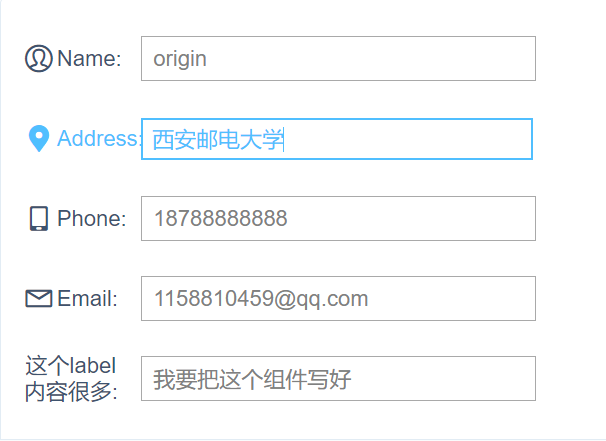
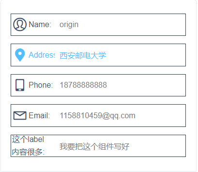

<script>
  export default{
    data () {
      return {
        name:"origin",
        phone:"18788888888",
        address:"西安邮电大学",
        email:"1158810459@qq.com",
        num:"只能输入9位数字",
        elseInput:"我要把这个组件写好"
      }
    },
    methods: {
    }
  }
</script>

# input 输入框
----
### 效果展示
```<w-input></w-input>```组件最终效果如下，主要包括label标签和图标设置、正则匹配(报错显示)、输入长度限制、选中切换颜色。下面请查看演示实例和实现代码。
<div class="demo-block">
  <w-input label="Name" check="text" v-model="name">
    <i class="w-icon-my" slot="labelIcon"></i>
  </w-input>
  <w-input label="Address" check="text" v-model="address">
    <i class="w-icon-lbsfill" slot="labelIcon"></i>
  </w-input>
  <w-input label="Phone" check="phone" v-model="phone">
    <i class="w-icon-mobile" slot="labelIcon"></i>
  </w-input>
  <w-input label="Email" check="email" v-model="email">
    <i class="w-icon-feedback" slot="labelIcon"></i>
  </w-input>
  <w-input label="这个label内容很多" v-model="elseInput"></w-input>
</div>

:::demo
```html
<w-input label="Name" check="text" v-model="name"></w-input>
<w-input label="Address" check="text" v-model="address"></w-input>
<w-input label="Phone" check="phone" v-model="phone"></w-input>
<w-input label="Email" check="number" v-model="email"></w-input>
<w-input label="这个label内容很多,并且只能输如入数字:" v-model="elseInput"></w-input>
<script>
  export default{
    data () {
      return {
        name:"origin",
        phone:"18788888888",
        address:"西安邮电大学",
        email:"1158810459@qq.com",
        elseInput:"只能输入数字"
      }
    },
    methods: {
    }
  }
</script>
```
:::

### 基本用法
#### 设置标注```label```
```<w-input></w-input>```设置```label```，例如```label="Name"```，如果```label```中要添加```icon```图标,可以通过slot插槽进行分发```<i class="w-icon-my" slot="labelIcon"></i>```。
<div class="demo-block">
  <w-input label="Name">
    <i class="w-icon-my" slot="labelIcon"></i>
  </w-input>
</div>

:::demo
```html
<w-input label="Name">
  <i class="w-icon-my" slot="labelIcon"></i>
</w-input>
```
:::

#### 正则检查```check```
正则检查的类型支持以下类型```email```、```phone```、```number```,默认值```text```不做处理.
<div class="demo-block">
    <w-input label="Phone" check="phone" v-model="phone">
      <i class="w-icon-mobile" slot="labelIcon"></i>
    </w-input>
    <w-input label="Email" check="email" v-model="email">
      <i class="w-icon-feedback" slot="labelIcon"></i>
    </w-input>
    <w-input label="Number" check="number" v-model="num" maxLength="9"></w-input>
</div>

:::demo
```html
<w-input label="Phone" check="phone" v-model="phone">
  <i class="w-icon-mobile" slot="labelIcon"></i>
</w-input>
<w-input label="Email" check="email" v-model="email">
  <i class="w-icon-feedback" slot="labelIcon"></i>
</w-input>
<w-input label="Number" check="number" v-model="num" maxLength="9"></w-input>
```
:::

#### 限制长度```maxLen```
设置```maxLenth="number"```,```number```为限定大小.
<div class="demo-block">
  <w-input label="Number" check="number" v-model="num" maxLength="9"></w-input>
</div>

:::demo
```html
<w-input label="Number" check="number" v-model="num" ></w-input>
```
:::

#### 自定义

#### 支持手机端和电脑端适配
在电脑端和手机端分别显示不同的样式，可以根据开发者工具查看手机端样式。
<div class="demo-block">
  <div>
    
    
  </div>
</div>

### Attributes

| 参数      | 说明   | 类型      | 可选值       | 默认值   |
|---------- |-------- |----------|-------------  |-------- |
| label     |   标注  | String   |—              |  —   |
| check     | 正则检查| String     |number,phone,email|text(不做处理)|
| v-model   | input绑定的值| String | —           | —      |
|maxlength  |限制input的长度
